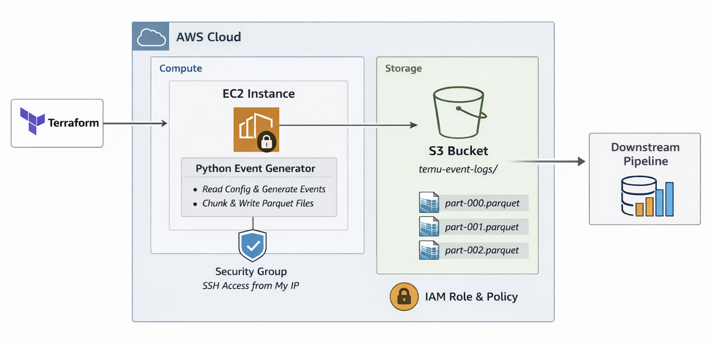
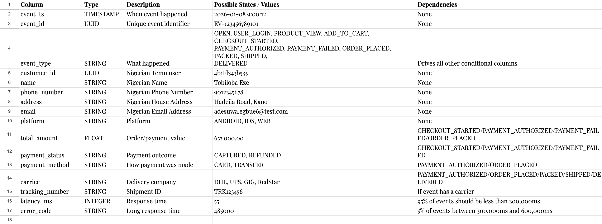
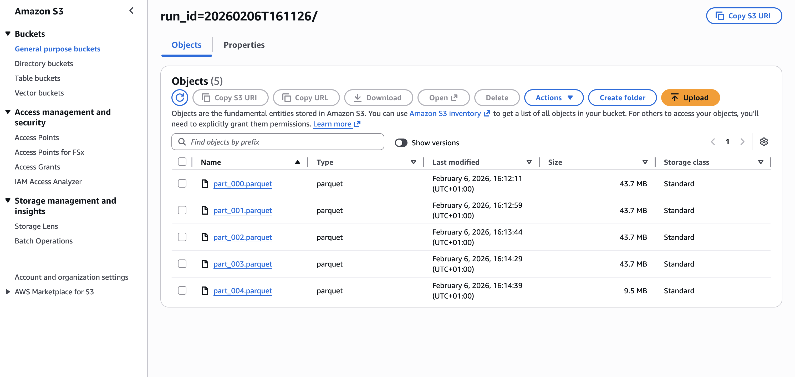
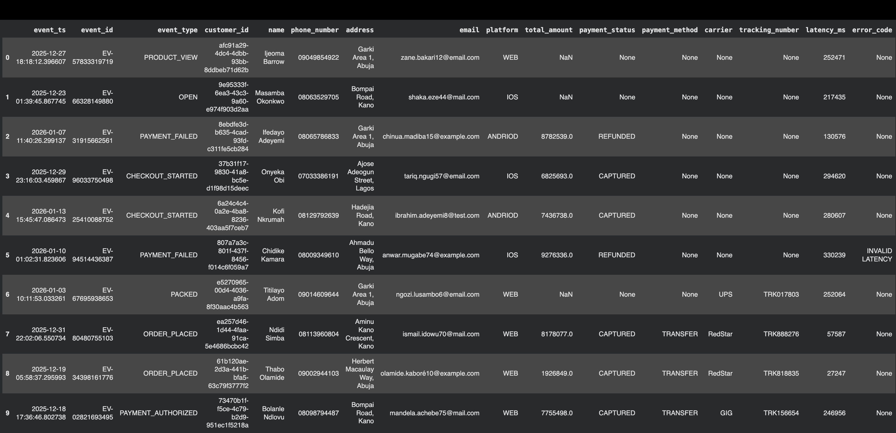

# Temu Nigeria Event Log Simulation
Simulating high-volume e-commerce event logs using Terraform, IAM, EC2, S3, and Python.

## Business Context
Temu’s launch in Nigeria represented a high-growth, high-traffic expansion into an existing e-commerce market. Before real users interacted with the platform at scale, the data team validated that event ingestion, storage, and downstream pipelines would reliably handle large volumes of diverse user activity.

This project simulates that pre-launch scenario by generating realistic Nigerian e-commerce event logs at scale. The goal is to test data platform readiness before production traffic hits, rather than reacting to failures after the fact.

## Project Overview

This system generates synthetic, append-only e-commerce event logs that mirror real user behavior across the full customer lifecycle. A Python generator runs on an Amazon EC2 instance and produces 2.1 million events per execution, writing the output to Amazon S3 as Parquet files.

All infrastructure is provisioned using Terraform, and the system is designed to operate under real cloud permissions and security constraints.

## High-Level Architecture

**Terraform → EC2 (Python generator + chunking) → S3 (Parquet event logs) → Downstream Pipeline**

- Terraform provisions all required AWS resources
- EC2 executes the event generation logic
- Event logs are written to S3 in chunked Parquet files
- Outputs are designed for consumption by downstream pipelines

## Infrastructure

Infrastructure is provisioned using Terraform to ensure reproducibility and security.

Provisioned resources include:

- Amazon S3 bucket for event logs  
  - Versioning enabled  
  - Server-side encryption  
  - Public access blocked  
- IAM role and policy with least-privilege S3 access  
- EC2 instance with attached instance profile  
- Security group restricting SSH access to a specified CIDR  
- Key pair managed through Terraform  

## Event Logs

The dataset is modeled as an append-only event log.

- **Grain:** one row represents a single event at a specific point in time
- **Event coverage:** full e-commerce lifecycle, from app open to delivery
- **Design choice:** state changes are represented as new events, not updates

## Data Dictionary

- Column names and data types  
- Field descriptions  
- Conditional dependencies  
- Allowed and expected values  

All generation rules are driven by a JSON configuration file. 

## Chunking Strategy

Each execution generates 2.1M events.

To avoid holding the full dataset in memory at once, the generator processes data in fixed-size chunks of 500,000 rows. Each chunk is generated, written to S3, and released from memory before the next chunk is created.

This improves stability, reduces memory pressure, and reflects common batch ingestion patterns used in production systems.

## Storage Layout

Event logs are written to S3 using a unique run ID for each execution.

## Data Sample

